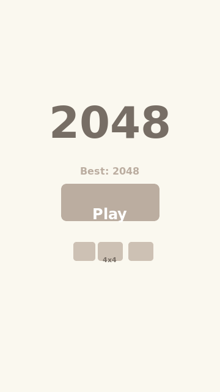
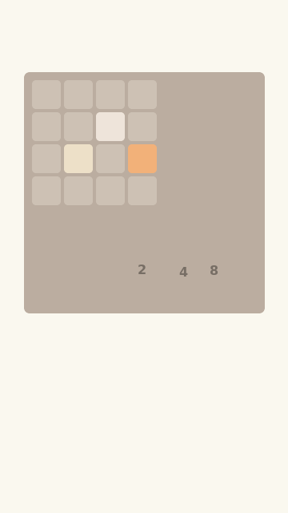
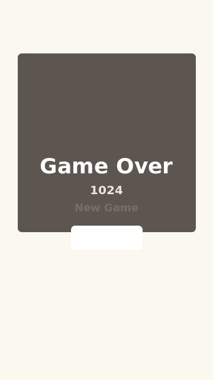
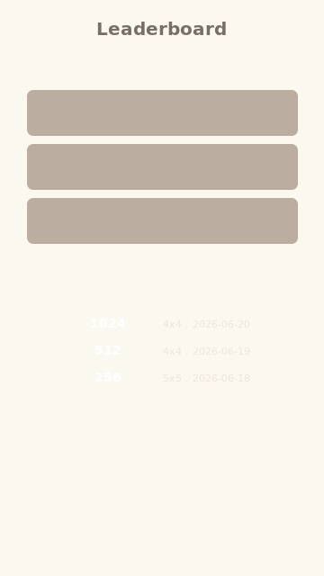

# 2048 Flutter

A feature-rich clone of the classic **2048 puzzle game** built with Flutter. Slide tiles, merge matching numbers, and reach the 2048 tile!

## Features

### Core Gameplay
- Swipe gestures (up, down, left, right) to move tiles
- Keyboard arrow key support (web/desktop)
- Smooth tile slide, merge pop, and new tile appear animations
- Score tracking with animated score display
- Win detection (optional continue-after-win)
- Game-over detection and restart
- Single-level undo

### Persistence
- Best score saved across sessions via file-based persistence
- Dark/light theme toggle with persisted preference
- Local leaderboard (top 5 scores saved by date and grid size)

### Customization
- Board size selector: **4×4** (classic), **5×5** (harder), or **6×6** (even harder)
- Dark mode 🌙 / Light mode ☀️

### Audio
- Swipe, merge, and new tile sound effects via `audioplayers` package

### Visual Style
- Original 2048 tile color scheme
- Tile pop animation on merge (elastic scale 1.0→1.15→1.0)
- New tile fade-in + scale (0→1)
- Score animation via TweenAnimationBuilder

## Screenshots

| Menu Screen | Game Screen | Game Over | Leaderboard |
|-------------|-------------|-----------|-------------|
|  |  |  |  |

*(Placeholder screenshots — replace with actual device captures for best quality)*

## Getting Started

### Prerequisites
- Flutter SDK (^3.11.5)
- Dart SDK (^3.11.5)

### Installing

```bash
# Clone the repo
git clone https://github.com/DWDS-Apps/2048-flutter.git
cd 2048-flutter

# Get dependencies
flutter pub get

# Run on connected device or emulator
flutter run
```

### Building

```bash
# Android APK
flutter build apk --release

# iOS (requires macOS + Xcode)
flutter build ios --release

# Web
flutter build web

# Linux
flutter build linux
```

### Android Play Store Release Signing

Play Console rejects debug-signed artifacts. Configure a release keystore once:

```bash
# from project root
keytool -genkey -v -keystore upload-keystore.jks -keyalg RSA -keysize 2048 -validity 10000 -alias upload
cp android/key.properties.example android/key.properties
```

Then update android/key.properties with real passwords and verify storeFile path.

Build signed release artifacts:

```bash
flutter build appbundle --release
# or
flutter build apk --release
```

## How to Play

1. **Start** — Tap "Play" on the menu screen. Optionally select a board size first.
2. **Swipe** — Swipe in any direction (or use arrow keys on desktop/web) to slide all tiles.
3. **Merge** — Equal tiles merge into one with their sum (e.g., 2+2 → 4).
4. **Score** — Each merge adds the merged value to your score.
5. **Win** — Reach **2048** to win! Tap "Keep Going" to continue.
6. **Game Over** — When the board is full with no possible merges, the game ends.
7. **Undo** — Use the Undo button to revert your last move (one level).

## Project Structure

```
lib/
├── main.dart                  # App entry point
├── app.dart                   # Root widget, theme management, routing
├── models/
│   └── game_state.dart        # Grid, tiles, score, move history, slide logic
├── controllers/
│   └── game_controller.dart   # Game logic: swipe, merge, undo, tile spawning
├── services/
│   ├── storage_service.dart   # SharedPreferences: best score, dark mode, leaderboard
│   └── sound_service.dart     # Sound effects via audioplayers
├── themes/
│   └── app_theme.dart         # Tile colors, light/dark themes
└── widgets/
    ├── menu_screen.dart       # Title screen with board size selector
    ├── game_screen.dart       # Game screen wiring controller -> widgets
    ├── game_board.dart        # Grid background + AnimatedPositioned tiles
    ├── tile_widget.dart       # Individual tile with animations
    ├── score_board.dart       # Current & best score display
    ├── game_overlay.dart      # Win/Game-over overlay
    └── leaderboard_screen.dart # Top 5 scores display
```

## Running Tests

```bash
flutter test
```

## Tech Stack

- **Framework:** Flutter (Dart)
- **State Management:** ChangeNotifier + ListenableBuilder (zero dependencies)
- **Persistence:** File-based JSON storage
- **Audio:** audioplayers

## License

This project is open source — feel free to build on it.
